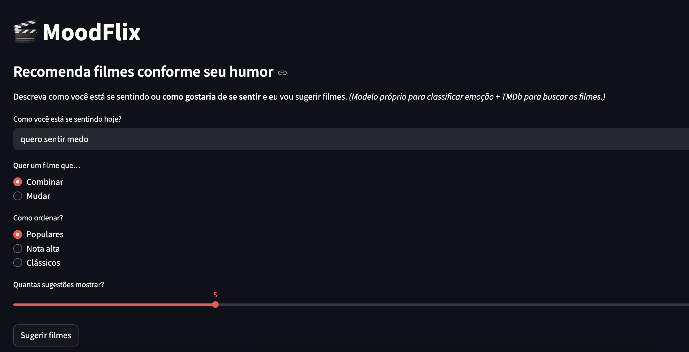
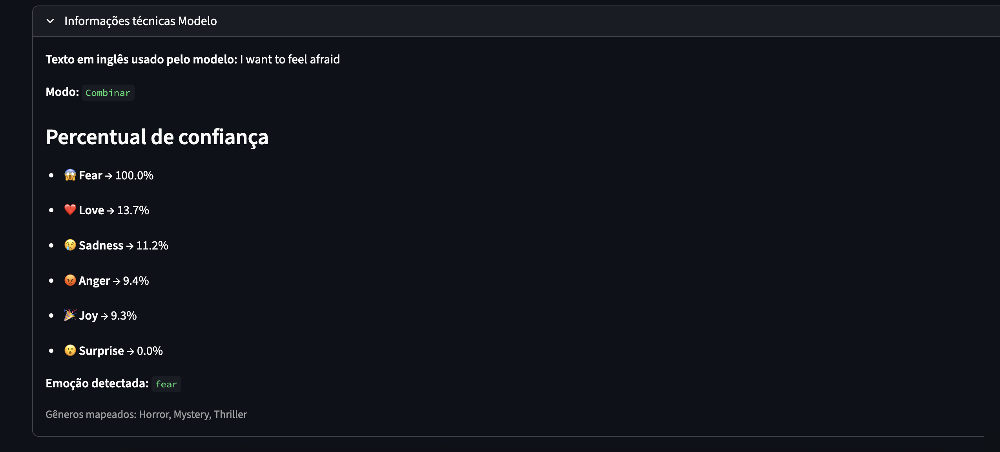

# 🎬 MoodFlix

MoodFlix é uma aplicação que recomenda filmes conforme o humor do usuário.

## 🚀 Como funciona
1. O usuário escreve como está se sentindo (em português).
2. O texto é traduzido automaticamente para inglês.
3. Um modelo de Machine Learning (SVM treinado em dataset de emoções) detecta a emoção.
4. A emoção é mapeada para gêneros de filmes.
5. A API do TMDb é usada para buscar os filmes.
6. O usuário escolhe se quer filmes que **combinem** ou que **mudem** o humor.


## 🖼️ Demonstração





## 🛠️ Tecnologias
- Python 3.13
- Streamlit
- scikit-learn
- Hugging Face Transformers
- TMDb API


## 📦 Instalação
```bash
git clone https://github.com/QueliHV/moodflix.git
cd moodflix
pip install -r requirements.txt
python -m streamlit run app/streamlit_app.py   


## 🔑 Configuração
Crie um arquivo .env com:
TMDB_API_KEY=seu_token_aqui